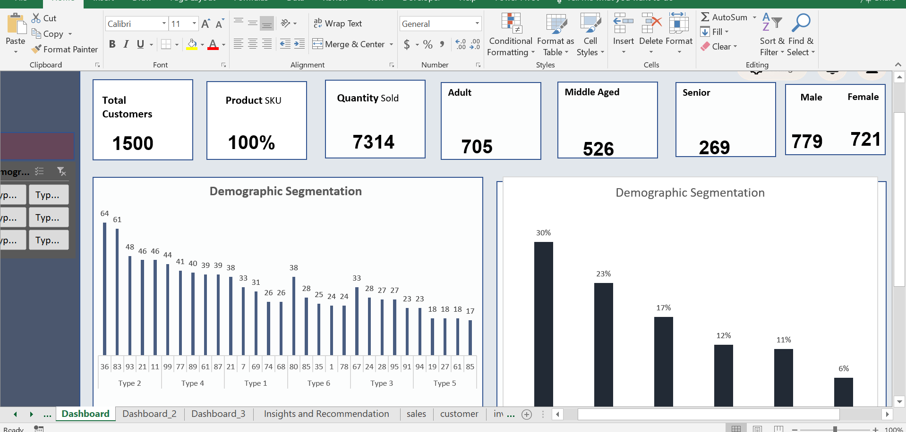
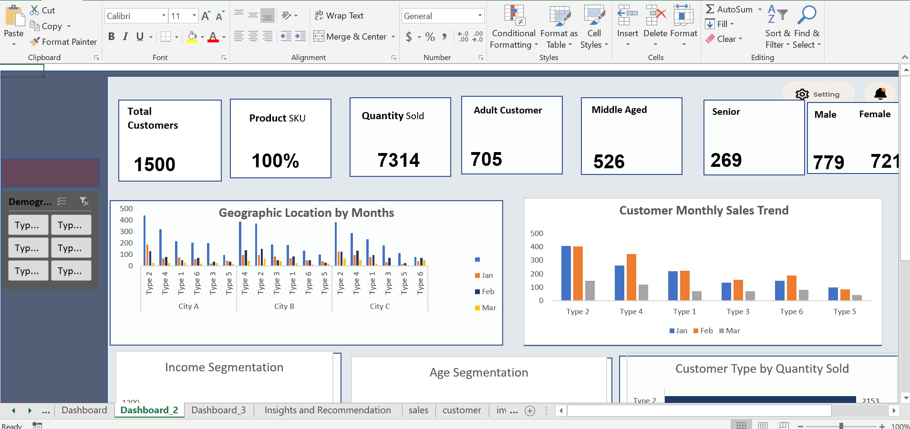
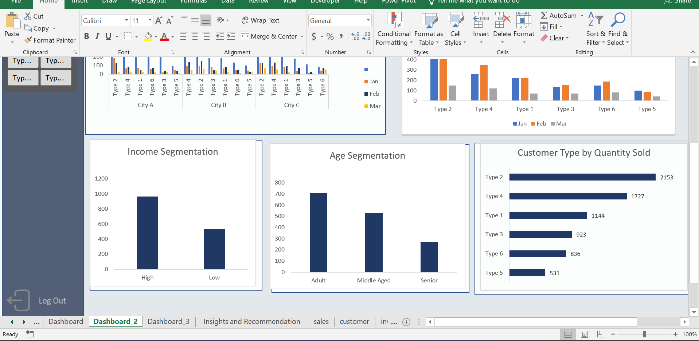
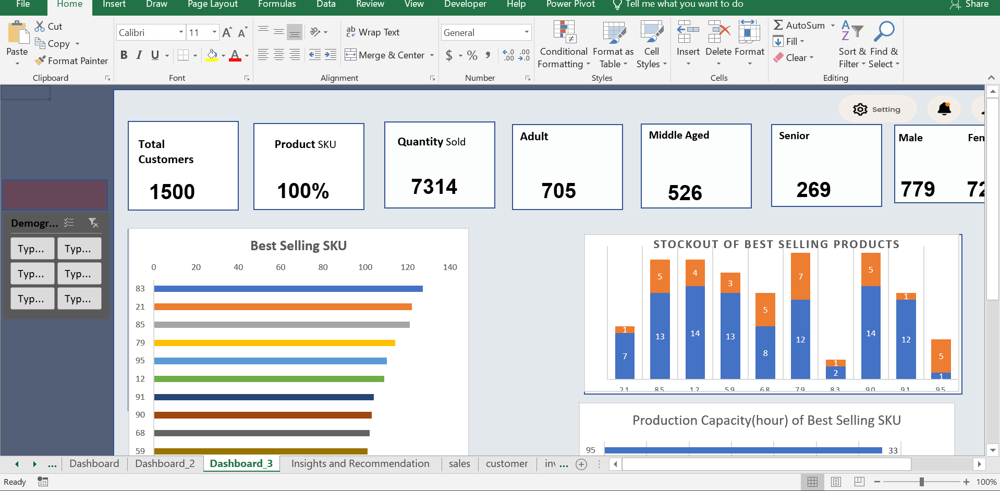
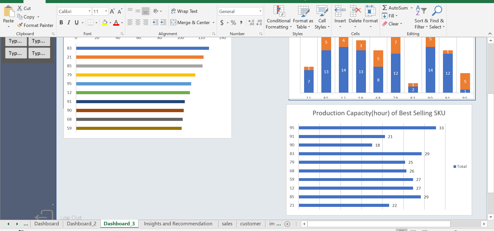

# Customer_Segmentation_Analysis
Customer Segmentation & Supply Chain Analytics | Microsoft Excel | Data Analytics — Refining production planning and supply chain efficiency using customer segmentation and data-driven insights.

# 🏭 Customer Segmentation for Production Planning  
## 📦 Microsoft Excel Supply Chain Analytics Project

---

## 🪄 Introduction
This project focuses on applying **customer segmentation and data analytics** using **Microsoft Excel** to support **production planning, inventory optimization, and supply chain efficiency**.

The analysis simulates a real-world business scenario at **SmartHome Solutions Inc.**, demonstrating how customer-centric, data-driven decision-making can reduce overproduction, minimize excess inventory, and better align production output with actual customer demand.

---

## 📊 Badges


---

## 📑 Table of Contents
- [Business Context](#-business-context)
- [Purpose of the Project](#-purpose-of-the-project)
- [Dataset Description](#-dataset-description)
- [Methodology (CRISP-DM)](#-methodology-crisp-dm)
- [Data Cleaning & Preparation](#-data-cleaning--preparation)
- [Key KPIs & Metrics](#-key-kpis--metrics)
- [Executive Dashboard](#-executive-dashboard)
- [Key Insights](#-key-insights)
- [Strategic Recommendations](#-strategic-recommendations)
- [Tools & Technologies](#-tools--technologies)
- [Repository Structure](#-repository-structure)
- [Conclusion](#-conclusion)
- [Author](#-author)

---

## 🧭 Business Context
SmartHome Solutions Inc. operates in a competitive consumer electronics and household appliances market where efficient production planning and supply chain agility are critical. Reliance on traditional forecasting methods has resulted in production inefficiencies, excess inventory, and misalignment with evolving customer demand patterns.

Customer segmentation provides a structured approach to understanding customer behavior, preferences, and demand variability, enabling more accurate production and inventory decisions.

---

## 🎯 Purpose of the Project
The primary objective of this project is to leverage **customer segmentation and exploratory data analysis** to enhance:
- Production planning accuracy  
- Inventory management efficiency  
- Demand-driven supply chain decision-making  

By transforming raw customer and sales data into actionable insights, the project supports a more customer-centric and cost-efficient supply chain strategy.

---

## 🗂️ Dataset Description

### Raw Datasets
👉 [customer.xlsx](raw/customer.xlsx)  
👉 [inventory.xlsx](raw/inventory.xlsx)  
👉 [sales_data.xlsx](raw/sales_data.xlsx)  
👉 [production.xlsx](raw/production.xlsx)

### Processed Dataset
👉 [solution.xlsx](processed/solution.xlsx)

The raw datasets contain unprocessed customer demographics, sales transactions, inventory levels, and production records. These datasets were cleaned, transformed, and consolidated into a structured format for analysis and visualization.

---

## 🔍 Methodology (CRISP-DM)
1. **Business Understanding** – Identify production and supply chain challenges  
2. **Data Understanding** – Explore customer, sales, inventory, and production data  
3. **Data Preparation** – Clean, transform, and integrate datasets  
4. **Modeling** – Perform customer segmentation and demand analysis  
5. **Evaluation** – Validate insights against business objectives  
6. **Deployment** – Communicate insights through dashboards and recommendations

---

## 🧹 Data Cleaning & Preparation
- Removed duplicates and handled missing values  
- Standardized categorical fields (gender, location)  
- Aggregated transactional sales data  
- Normalized numerical fields for segmentation analysis  
- Integrated raw datasets into a single processed solution file

---

## 📌 Key KPIs & Metrics
- Customer Segment Distribution  
- Revenue by Customer Segment  
- Average Order Quantity  
- Demand Variability by Segment  
- Inventory Turnover Ratio  
- Production Output vs Customer Demand

---

## 📈 Executive Dashboard

### Dashboard Preview
  
  
  
  


---

## 💡 Key Insights
- Distinct customer segments exhibit significantly different purchasing patterns  
- High-value customer segments drive a disproportionate share of revenue  
- Demand variability is concentrated within specific geographic and income-based segments  
- Excess inventory is largely driven by misalignment between production output and high-demand segments

---

## 🧠 Strategic Recommendations
1. Implement segment-based production planning models  
2. Prioritize inventory allocation for high-value customer segments  
3. Reduce overproduction by aligning output with demand trends  
4. Integrate customer analytics into ongoing supply chain planning processes  
5. Continuously monitor segment-level demand changes

---

## 🧰 Tools & Technologies
- Microsoft Excel  
- Pivot Tables & Charts  
- Excel Dashboards  
- CRISP-DM Framework

---

## 📁 Repository Structure
```text
Customer_Segmentation/
│
├── raw/
│   ├── customer.xlsx
│   ├── inventory.xlsx
│   ├── sales_data.xlsx
│   └── production.xlsx
│
├── processed/
│   └── solution.xlsx
│
├── dashboard/
│   ├── pics_1.png
│   ├── pics_2.png
│   ├── pics_3.png
│   ├── pics_4.png
│   └── pics_5.png
│
├── slides/
│   └── recommendation.pptx
│
├── README.md
└── LICENSE
```

---

## 🏁 Conclusion
This project demonstrates how Excel-based customer segmentation and data analytics can significantly improve production planning and supply chain efficiency. By adopting a customer-centric, data-driven approach, organizations can reduce operational costs, improve demand alignment, and enhance overall supply chain performance.

---

## 👩‍💻 Author
**Charles Walton**  
Data Analyst Consultant  
📧 cwalton1335@gmail.com

